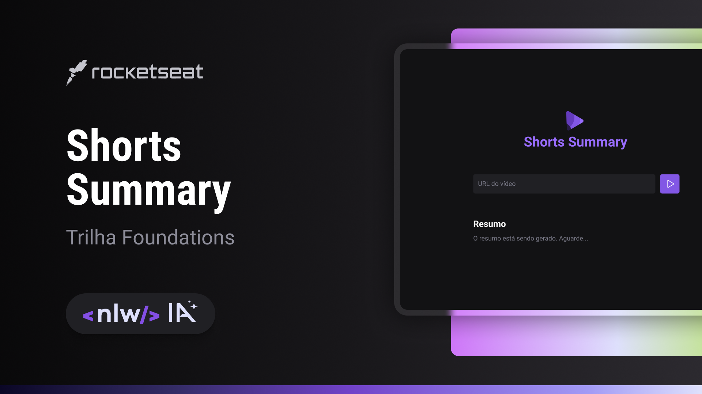

# NLW eSports

> Trilha Foundations

Projeto construído do evento Next Level Week IA da Rocketseat.

[🔗 Clique aqui para acessar](https://github.com/fau-33/nlwia)

## 🛠 Tecnologias

- HTML
- CSS
- Git e Github
- JAVASCRIPT
- Express
- Vite
- Inteligência Artificial
- AXIOS
- CORS
- ffmpeg-static
- fluent-ffmpeg
- node-wav
- ytdl-core

## 💛 Contato

flavioleandrovasco@gmail.com
